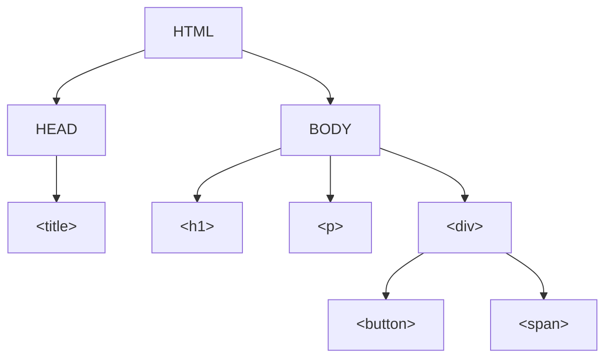

---
tags:
  - Javascript
  - mini-training
---
# DOM Manipulation

## 1. **Grundlagen der DOM-Manipulation**

### 1.1 Was ist das DOM?

Das Document Object Model (DOM) repräsentiert die HTML-Struktur einer Webseite als Baumstruktur. Jede HTML-Tag wird als Objekt (Node) behandelt, das mit JavaScript manipuliert werden kann.


### 1.2 Zugriff auf das DOM

- `document` ist das Ausgangsobjekt für alle DOM-Operationen.
- Zugriffsmethoden:
    
    ```javascript
    document.getElementById("id")      // Zugriff auf ein Element nach ID
    document.querySelector("selector") // Zugriff auf das erste Element, das dem CSS-Selektor entspricht
    document.querySelectorAll("selector") // Zugriff auf alle Elemente, die dem CSS-Selektor entsprechen
    document.getElementsByClassName("class") // Zugriff auf Elemente nach Klassenname
    document.getElementsByTagName("tag")    // Zugriff auf Elemente nach Tag-Name
    ```
    

## 2. **Manipulation von Elementen**

### 2.1 Inhalt ändern

- `innerHTML` vs. `textContent`:
    
    ```javascript
    const element = document.getElementById("example");
    element.innerHTML = "<strong>Neuer Inhalt</strong>"; // Erlaubt HTML
    element.textContent = "Neuer Text"; // Nur Text
    ```
    

### 2.2 Attribute ändern

- Methoden:
    
    ```javascript
    const image = document.querySelector("img");
    image.setAttribute("src", "bild.jpg");
    image.getAttribute("alt");
    image.removeAttribute("title");
    ```
    

### 2.3 CSS-Klassen manipulieren

- Klassenzugriff:
    
    ```javascript
    const element = document.querySelector(".box");
    element.classList.add("neue-klasse");
    element.classList.remove("alte-klasse");
    element.classList.toggle("highlight");
    element.classList.contains("active");
    ```
    

### 2.4 CSS direkt ändern

- Inline-Styles setzen:
    
    ```javascript
    const button = document.querySelector("button");
    button.style.backgroundColor = "blue";
    button.style.fontSize = "16px";
    ```
    

## 3. **Erstellen und Entfernen von DOM-Elementen**

### 3.1 Neues Element erstellen

- `document.createElement()`:
    
    ```javascript
    const newDiv = document.createElement("div");
    newDiv.textContent = "Ich bin ein neuer Div!";
    document.body.appendChild(newDiv); // Fügt das Element am Ende des <body> hinzu
    ```
    

### 3.2 Entfernen von Elementen

- Entfernen mit `remove()`:
    
    ```javascript
    const element = document.getElementById("removeMe");
    element.remove();
    ```
    
- Entfernen mit Elternknoten:
    
    ```javascript
    const parent = document.querySelector(".container");
    const child = document.querySelector(".child");
    parent.removeChild(child);
    ```
    

## 4. **DOM-Ereignisse (Events)**

### 4.1 Hinzufügen eines Event Listeners

- Syntax:
    
    ```javascript
    const button = document.querySelector("button");
    button.addEventListener("click", () => {
      alert("Button wurde geklickt!");
    });
    ```
    

### 4.2 Häufige Ereignisse

- `click`: Bei Klick auf ein Element
- `input`: Bei Eingabe in ein Formularfeld
- `submit`: Beim Absenden eines Formulars
- `keydown` / `keyup`: Beim Drücken oder Loslassen einer Taste
- `mouseover` / `mouseout`: Wenn die Maus über ein Element fährt oder es verlässt

### 4.3 Ereignisse entfernen

- `removeEventListener`:
    
    ```javascript
    function logClick() {
      console.log("Button wurde geklickt");
    }
    
    const button = document.querySelector("button");
    button.addEventListener("click", logClick);
    button.removeEventListener("click", logClick);
    ```
    

## 5. **Traversal: Navigieren durch den DOM-Baum**

### 5.1 Eltern-, Kind- und Geschwisterknoten

- Elternknoten:
    
    ```javascript
    const child = document.querySelector(".child");
    const parent = child.parentNode; // Oder child.parentElement
    ```
    
- Kindknoten:
    
    ```javascript
    const parent = document.querySelector(".parent");
    const children = parent.children; // HTMLCollection
    const firstChild = parent.firstElementChild;
    const lastChild = parent.lastElementChild;
    ```
    
- Geschwisterknoten:
    
    ```javascript
    const current = document.querySelector(".current");
    const next = current.nextElementSibling;
    const prev = current.previousElementSibling;
    ```
    

## 6. **DOMContentLoaded vs. Load**

### 6.1 DOMContentLoaded

- Wird ausgelöst, wenn das HTML vollständig geladen und geparst wurde:
    
    ```javascript
    document.addEventListener("DOMContentLoaded", () => {
      console.log("DOM ist geladen!");
    });
    ```
    

### 6.2 Load

- Wird ausgelöst, wenn alle Ressourcen (Bilder, Skripte etc.) vollständig geladen wurden:
    
    ```javascript
    window.addEventListener("load", () => {
      console.log("Seite ist vollständig geladen!");
    });
    ```